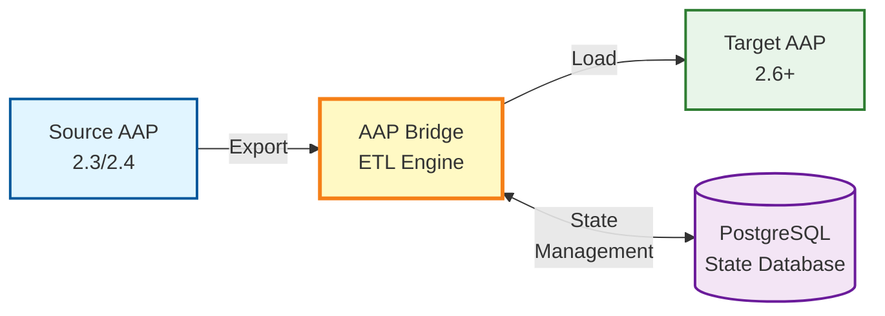

# AAP Bridge

A production-grade Python tool for migrating Ansible Automation Platform (AAP)
installations from one version to another, designed to handle large-scale
migrations (e.g., 80,000+ hosts).

## Key Features

- **Bulk Operations** - Leverages AAP bulk APIs for high-performance migrations
- **State Management** - PostgreSQL-backed state tracking with checkpoint/resume
  capability
- **Idempotency** - Safely resume interrupted migrations without creating
  duplicates
- **Professional Progress Display** - Rich-based live progress with real-time
  metrics
- **Flexible Output Modes** - Normal, quiet, CI/CD, and detailed modes
- **Comprehensive Logging** - Structured logging with separate console and file
  levels
- **Split-File Export/Import** - Automatic file splitting for large datasets

## Quick Links

- :material-download: **[Installation](getting-started/installation.md)**

    Get AAP Bridge installed on your system

- :material-rocket-launch: **[Quick Start](getting-started/quickstart.md)**

    Get up and running in 5 minutes

- :material-console: **[CLI Reference](user-guide/cli-reference.md)**

    Complete command reference

- :material-cog: **[Configuration](getting-started/configuration.md)**

    Configure AAP Bridge for your environment

## Architecture Overview

AAP Bridge follows an ETL (Export, Transform, Load) architecture:

**Components:**

- **Client Layer** - HTTP clients for source AAP, target AAP, and HashiCorp
  Vault
- **Migration Layer** - ETL pipeline with exporters, transformers, and importers
- **State Management** - Database-backed progress tracking and ID mapping
- **CLI** - User-friendly command-line interface

## Migration Order

Resources are migrated in dependency order:

1. Organizations, Labels, Users, Teams
2. Credential Types, Credentials
3. Execution Environments
4. Inventories, Inventory Sources, Inventory Groups
5. Hosts (bulk operations)
6. Instances, Instance Groups
7. Projects
8. Job Templates, Workflows
9. Schedules

## License

This project is licensed under the GNU General Public License v3.0.

## Support

- **Issues**: [GitHub Issues](https://github.com/antonysallas/aap-bridge/issues)
- **Security**: See
  [SECURITY.md](https://github.com/antonysallas/aap-bridge/blob/main/SECURITY.md)
